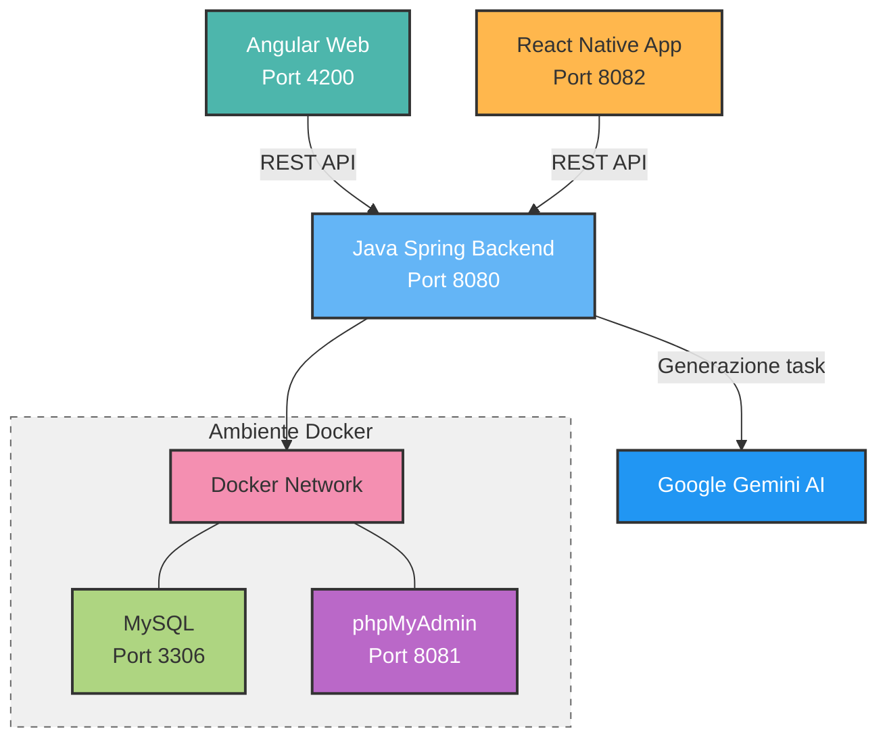
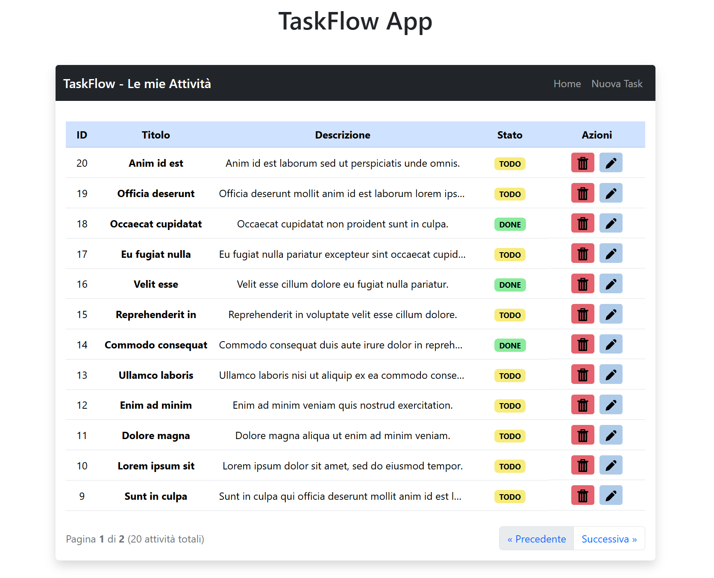
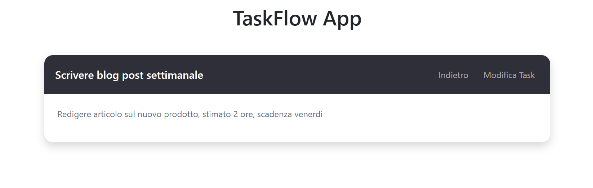
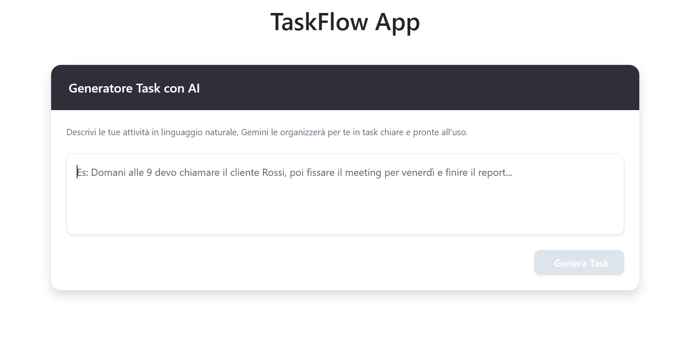
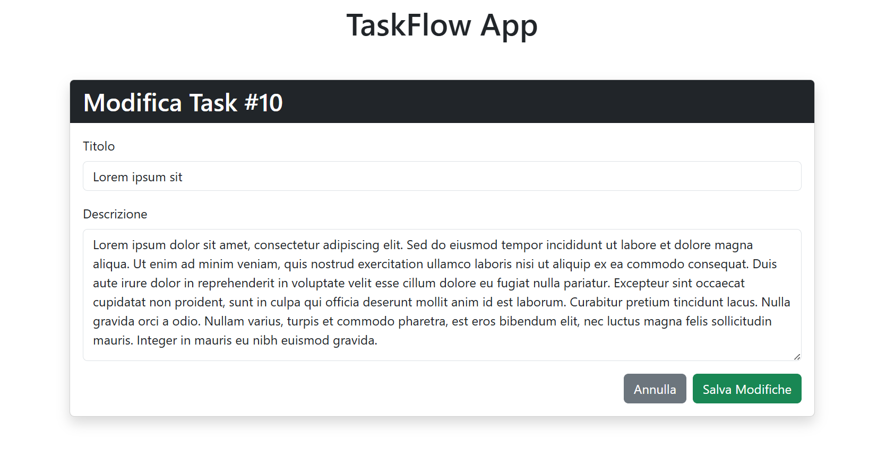
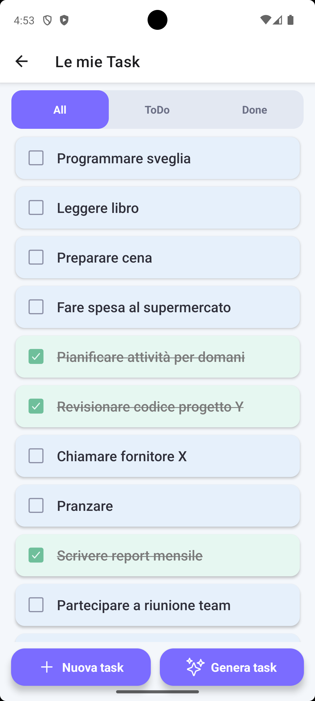
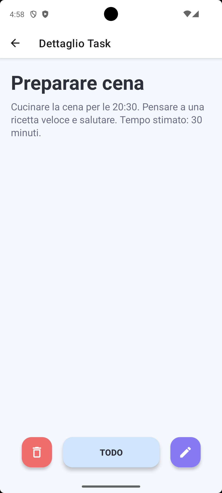
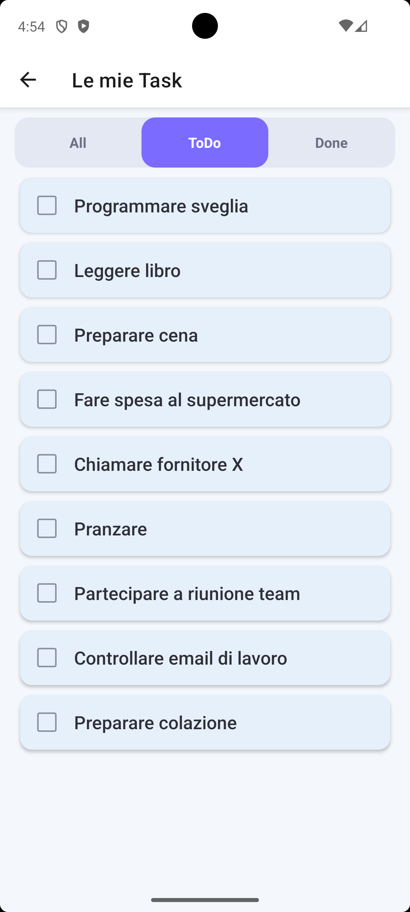

# TaskFlow App AI


**TaskFlow** è una semplice applicazione Web Full-Stack per la gestione dei task, con la possibilità di generazione dei task tramite AI.<br>
Il progetto si basa su un Backend condiviso tra Frontend Web e Frontend Mobile.

- Web → **Angular 18+** (standalone components + signals)
- Mobile → **React Native + Expo** (SDK 50+)
- Backend → **Spring Boot 3**

## Stack Tecnologico

### AI
- **Google AI**: Per la creazione automatizzata dei task

### Backend
- **Java 17+** & **Spring Boot 3.4.1**
- **Spring AI**: Integrazione nativa per l'orchestrazione di modelli LLM
- **Google Gemini AI**: Utilizzato per la generazione automatica dei task
- **JPA**: Standard Java per salvare dati
- **Hibernate**: Motore ORM per mappare classi e tabelle
- **Spring Data JPA**: Gestione semplice di repository e query
- **MySQL 8**: Database ospitato su container Docker
- **Architettura Layered**: Controller → Service → Repository → Entity


### Frontend Web
- **Angular 18+**: Utilizzo di **Standalone Components**
- **Angular Signals**: Gestione dello stato reattiva per aggiornamenti dell'interfaccia
- **Bootstrap 5**: Stili e layout base per l’interfaccia

### Frontend Mobile
- **React Native** + **Expo SDK 50+**
- **TypeScript** / JavaScript
- **React Navigation** (Stack Navigator)
- **Axios** per le chiamate HTTP
- **StyleSheet** per UI mobile-native
- Indirizzo backend dall'emulatore: `http://10.0.2.2:8080/api`

### Infrastruttura
- **Docker & Docker Compose**: Per la containerizzazione del database e di phpMyAdmin
- **Maven**: Gestione delle dipendenze Java
- **npm**: Dipendenze ambienti di sviluppo e build del Frontend
- **Git**: Versionamento con gestione monorepo

### Architettura

---

## API Endpoints (REST)

### Task Management
| Metodo | Endpoint | Descrizione |
| :--- | :--- | :--- |
| **GET** | `/api/tasks` | Recupero tutti i task |
| **GET** | `/api/tasks?page=0&size=20` | Recupero task con paginazione lato server |
| **GET** | `/api/tasks/{id}` | Recupero dettaglio singolo task |
| **POST** | `/api/tasks` | Creazione di una nuova task |
| **PATCH** | `/api/tasks/{id}` | Modifica completa dei campi di una task |
| **PATCH** | `/api/tasks/{id}/status` | Aggiornamento rapido dello status (TODO/DONE) |
| **DELETE** | `/api/tasks/{id}` | Eliminazione definitiva di una task |

### AI Generation
| Metodo | Endpoint | Descrizione |
| :--- | :--- | :--- |
| **POST** | `/api/tasks/ai/generate` | Generazione automatica di task multipli tramite prompt |

---

## Sicurezza e Comunicazione (CORS)
Per permettere al Frontend Web (Angular) e Mobile (React Native) di comunicare correttamente con il Backend, è stata implementata una policy CORS dinamica che abilita:

- **Web**: Abilitato l'accesso per `http://localhost:4200`
- **Mobile**: Accesso configurato per l'IP locale della workstation (necessario per il debug su dispositivi fisici tramite Expo Go) e per l'indirizzo standard dell'emulatore Android `10.0.2.2`
- **Metodi**: Supporto completo per `GET`, `POST`, `PATCH`, `DELETE` e `OPTIONS`

---

## Installazione e avvio

### Prerequisiti

- Java 17+, Maven
- Node.js 20+, npm
- Angular CLI (per web)
- Expo CLI (`npm install -g expo-cli`) o `npx expo`
- Docker Desktop
- Android Studio (emulatore) o dispositivo fisico per il mobile

### 1. Database (Docker)
Dalla cartella root del progetto, avvia i container per MySQL e phpMyAdmin:
```bash
docker compose up -d
```
- phpMyAdmin (UI database) disponibile su: http://localhost:8081/

### 2. Configurazione AI
Per utilizzare la funzione AI è necessario ottenere una **API Key** su [Google AI Studio](https://aistudio.google.com/api-keys)

Per configurare la API Key ci sono due opzioni:
- **Variabile d'ambiente (Consigliato)**: imposta una variabile d'ambiente sul tuo sistema operativo chiamata **GEMINI_API_KEY**

```bash
# Windows (PowerShell)
setx GEMINI_API_KEY "tua_chiave_qui"

# Linux / Mac
export GEMINI_API_KEY="tua_chiave_qui"
```

- **File di configurazione**: Inserisci la chiave direttamente nel file `taskflow-backend/src/main/resources/application.properties`

```properties
spring.ai.google.genai.api-key=INSERIRE_QUI_LA_CHIAVE
```

### 3. Avvio Backend
```bash
cd taskflow-backend
mvn spring-boot:run
```
- API REST disponibile su: http://localhost:8080/api/tasks

### 4. Avvio Frontend Web
```bash
cd taskflow-frontend-web
npm install
ng serve
```
- App disponibile su: http://localhost:4200

### 5. Avvio Frontend Mobile
```bash
cd taskflow-frontend-mobile
npm install
npx expo start
```
- Emulatori: Premi `a` per Android o `i` per iOS (solo macOS).
- Dispositivo Fisico: Inquadra il QR code con l'app Expo Go (disponibile su Play Store/App Store).

---

## Funzionalità 

### Backend (API REST)
- CRUD completo dei task
- Recupero task singolo per ID
- Aggiornamento rapido dello status (TODO/DONE)
- Aggiornamento completo dei campi
- Paginazione lato server
- AI Task Generation

### Frontend Web (Angular)
- Visualizzazione task in tabella
- Creazione, modifica ed eliminazione task
- Creazione task tramite AI
- Toggle rapido dello status
- Aggiornamento automatico della UI
- Gestione loading e lista vuota
- Paginazione

### Frontend Mobile (React Native)
- Visualizzazione task
- Creazione task
- Creazione task tramite AI
- Visualizzazione singolo task con modifica e cancellazione
- Toggle rapido dello status tramite checkbox
- Aggiornamento automatico della UI
- Filtro task Todo e Done
- Swipe per cancellazione task

---

## Screenshot
### Web
---
#### Lista Task


#### Dettaglio Task


#### Creazione Task


#### Genera Task con AI


#### Modifica Task


### Mobile
---
#### Lista Task Mobile


#### Dettaglio Task Mobile


### Filtro Task Todo/Done

| Task Todo | Task Done |
| :---: | :---: |
|  |  |

#### Modifica Task


#### Genera Task con AI


